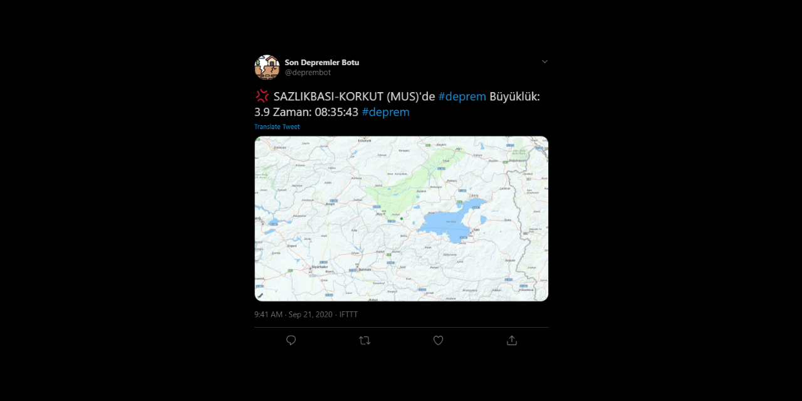

# Earthquakes Action for Twitter

Earthquakes Action is Github Action that posts tweet when specified earthquakes happened.

## Screenshot



## Requirements

1. IFTTT Account.
2. Public or private Github repo.

## Usage

1. Fork this repo.
2. Create an IFTTT Applet: If webhooks triggered, send tweet with image.
3. Tweet text should be Value2 variable and image URL should be Value1.
4. Go to Here Developers and create a free developer account. Create a REST App.
5. Go to your forked repo's "Settings" tab and navigate to "Secrets" from left sidebar.
6. Create secrets according to your IFTTT and Here Developer acoounts:

```bash
IFTTT_WEBHOOKS_KEY=bjGgV5Ks8YuF8MTH5ZRQez # You can get this key from Webhooks service settings
IFTTT_EVENT=new_erthquake # Event name which used in your IFTTT Applet
# Map
HERE_API_KEY=ggcK_EbdlrIMyb7RgJhI_yOeZ5wk88aKAOm2uQSuX7o # Here Map API Key
# Criteria parameters
CITIES_DELIMITED_WITH_SEMICOLON=BINGOL;BALIKESIR # Or * character for all cities
MIN_MAGNITUDE=3.5
# for debugging purposes
ACTIONS_STEP_DEBUG=true
```

## Contributing

Pull requests are welcome. For major changes, please open an issue first to discuss what you would like to change.

Please make sure to update tests as appropriate.

## License

[MIT](https://choosealicense.com/licenses/mit/)